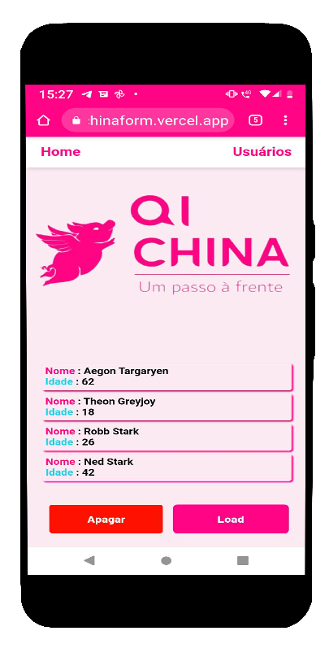

<h1 align=center>

</h1>

  <a href="#projeto">Projeto</a>&nbsp;&nbsp;&nbsp;|&nbsp;&nbsp;&nbsp;
  <a href="#tecnologias">Tecnologias</a>&nbsp;&nbsp;&nbsp;|&nbsp;&nbsp;&nbsp;
  <a target="__blank" href="https://react-qi-chinaform.vercel.app/">Deploy na Vercel</a>&nbsp;&nbsp;&nbsp;|&nbsp;&nbsp;&nbsp;
  <a href="#executar">Execução</a>&nbsp;&nbsp;&nbsp;|&nbsp;&nbsp;&nbsp;
  <a href="#env">Variável Ambiente</a>

<h1 align=center>
 Tela principal 💜
</h1>

  

<h2 align=center>Responsividade no Smartphone :iphone: </h2>

  

<h2 align=center>Vídeo de demonstração ⏯️
  
 
 
  

</h2>

 
<h2 id="projeto">
💻 Projeto
</h2>

O desafio proposto é um formulário com os campos de nome e idade. Ao cadastrar esses dados, a aplicação salva as informações em um banco de dados provido pelo FireBase, da Google. Em seguida temos outra tela que apresenta esses dados sendo capiturados diretamente do banco de dados. Podemos deletar, criar ou visualizar os usuários.

 
 

<h2 id="tecnologias">
🚀 Tecnologias
</h2>

Esse projeto foi desenvolvido com a biblioteca:
- [React.js](https://pt-br.reactjs.org/)
- [Sweet-Alert](https://sweetalert.js.org/)
- [FireBase](https://firebase.google.com/docs?hl=pt-br)

Linguagens de marcação, estilo e programação:
 
<ul>
<li>HTML</li>
<li>CSS</li>
<li>JavaScript</li>
</ul>

 
 

<h2 id="executar">
🔴 Execução
</h2>

## Clique aqui [desafio Instituto Qi China](https://react-qi-chinaform.vercel.app/)

### Scripts para clone, instalação e execução da aplicação

##### Você precisará de um terminal git, se estiver no Windows instale o [bash](https://git-scm.com/downloads)
##### 🌟 Para Linux ou MAC : [Linux](https://git-scm.com/book/pt-br/v2/Come%C3%A7ando-Instalando-o-Git) / [Mac](https://www.atlassian.com/br/git/tutorials/install-git)

### Para acompanhar, editar ou ver o andamento do projeto -
### `git clone https://github.com/lazarok09/react-qi-chinaform.git`

#### `yarn add node`
#### ou
#### `npm install node`

##### em seguida

#### `npm start`

A aplicação vai abrir em :
[http://localhost:3000](http://localhost:3000)

⚠️ Esse projeto utiliza variável ambiente com credenciais reais na forma final, então teremos partes comentadas no arquivo .env_sample. Caso queira clonar a aplicação e usar seu banco de dados, você deverá alterar o arquivo .env_sample para apenas .env, removendo assim o _sample. Em seguida, preencha todos os xxxxx com as credenciais corretas. você pode encontrá-las na hora que cria seu próprio FireStore, banco de dados do FireBase. Nesse projeto, li e utilizei a própria API de referência.

📘 Acesse [Fire Store](https://firebase.google.com/docs/firestore/quickstart)

## :pencil2: Autor
Lazaro Souza :runner:  
Entusiasta na arte de aprender algo do zero 
Cursando Superior de Tecnologia em Análise e Desenvolvimento de Sistemas :books: (2020-2022) 

https://www.linkedin.com/in/lazarok09
### Aprenda a usar o [markdown](https://docs.pipz.com/central-de-ajuda/learning-center/guia-basico-de-markdown#open) no seu GitHub
#### Use [emojis](https://github.com/ikatyang/emoji-cheat-sheet) no seu readme :P

< / :heart: >

